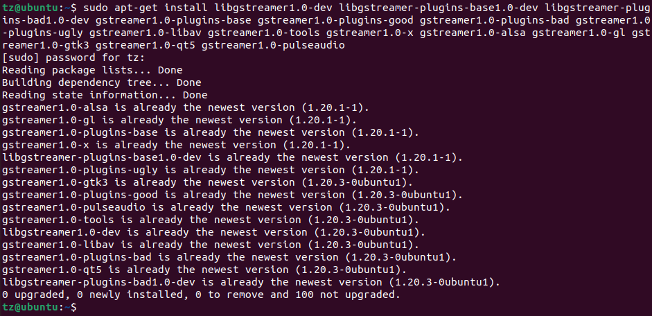

# Lab 1: Set up Hello AI World Environment


# 1. Prerequisites:
- `Jetson Nano 4G` with `Jack interface` power supply
  
  

  
  
- USB webcam
  
  

- Development PC: Ubuntu 22.04 on AMD64
- Monitor - optional
- USB Keyboard and mice
 


# 2. Download and run as a container

The easiest way is to download and run in the container.

```
$ git clone --recursive https://github.com/dusty-nv/jetson-inference
$ cd jetson-inference
$ docker/run.sh
```


# 3. Build from the source

You may also choose to run in local environment, then you need build from the source.

```
$ sudo apt-get update
$ sudo apt-get install git cmake libpython3-dev python3-numpy
$ git clone --recursive https://github.com/dusty-nv/jetson-inference
$ cd jetson-inference
$ mkdir build
$ cd build
$ cmake ../
$ make -j$(nproc)
$ sudo make install
$ sudo ldconfig
```


	
# 4. Run video-viewer to check if the camera works

Once the container is running, try to run video-viewer.

```
ls /dev/video*
```


Run video-viewer.

```
video-viewer /dev/video0
```


You may also try to ue detectNet to detect images.

In the container, run below commands:

```
$ detectnet /dev/video0
```


# 5. View the image from remote PC
	
## 5.1 Set up test PC
	
The test PC is running `Ubuntu 22.04 LTS` on `AMD64`.


## 5.2 Install gstreamer

https://gstreamer.freedesktop.org/documentation/installing/on-linux.html?gi-language=c

Run below command.

```
$sudo apt-get install libgstreamer1.0-dev libgstreamer-plugins-base1.0-dev libgstreamer-plugins-bad1.0-dev gstreamer1.0-plugins-base gstreamer1.0-plugins-good gstreamer1.0-plugins-bad gstreamer1.0-plugins-ugly gstreamer1.0-libav gstreamer1.0-tools gstreamer1.0-x gstreamer1.0-alsa gstreamer1.0-gl gstreamer1.0-gtk3 gstreamer1.0-qt5 gstreamer1.0-pulseaudio
```



## 5.3 Remote login to Jetson Nano and run docker

```
$ ssh tz@192.168.5.159
$ cd jetson-inference/
$ docker/run.sh
```


## 5.4 RTP camera to remote PC

On container, run below command:

```
$ video-viewer /dev/video0 rtp://192.168.5.143:1234
```


Use Gstreamer to view the camera image.

On Ubuntu terminal, run below command:

```
$ gst-launch-1.0 -v udpsrc port=1234 \
 caps = "application/x-rtp, media=(string)video, clock-rate=(int)90000, encoding-name=(string)H264, payload=(int)96" ! \
 rtph264depay ! decodebin ! videoconvert ! autovideosink
```


## 5.5 RTP detectnet image to test PC

```
$detectnet /dev/video0 rtp://192.168.5.143:1234 
```


On Ubuntu terminal, run Gstreamer:

```
$ gst-launch-1.0 -v udpsrc port=1234 \
 caps = "application/x-rtp, media=(string)video, clock-rate=(int)90000, encoding-name=(string)H264, payload=(int)96" ! \
 rtph264depay ! decodebin ! videoconvert ! autovideosink
```


`<END of Lab1>`


