# Lab 2: Classify Images with ImagNet

# 1. Prerequisites:
- Lab1 is completed.

# 2. Run container
	
```
$ cd ~/jetson-inference
$ ./docker/run.sh
```	
	
# 3. Navigate to bin folder in the container

```	
$ root@jetons-nano: /jetson-inference #
$ cd build/aarch64/bin/
$ ls
```
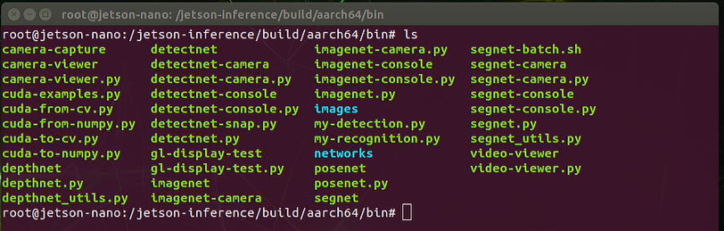
	
# 4. List the images in the images folder

```	
$ ls images
```	
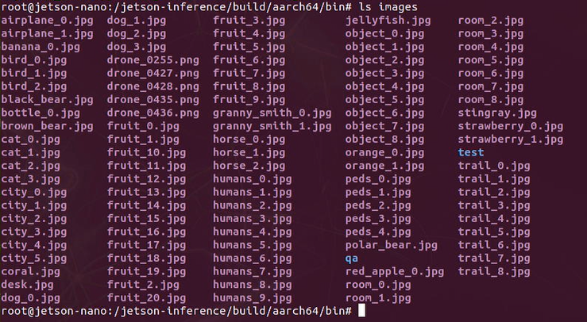
	
	
# 5. Use imagenet to classify images

```
$ imagenet.py "images/object_*.jpg" "images/test/object_%i.jpg"
```
By default, it uses GoogleNet.


	
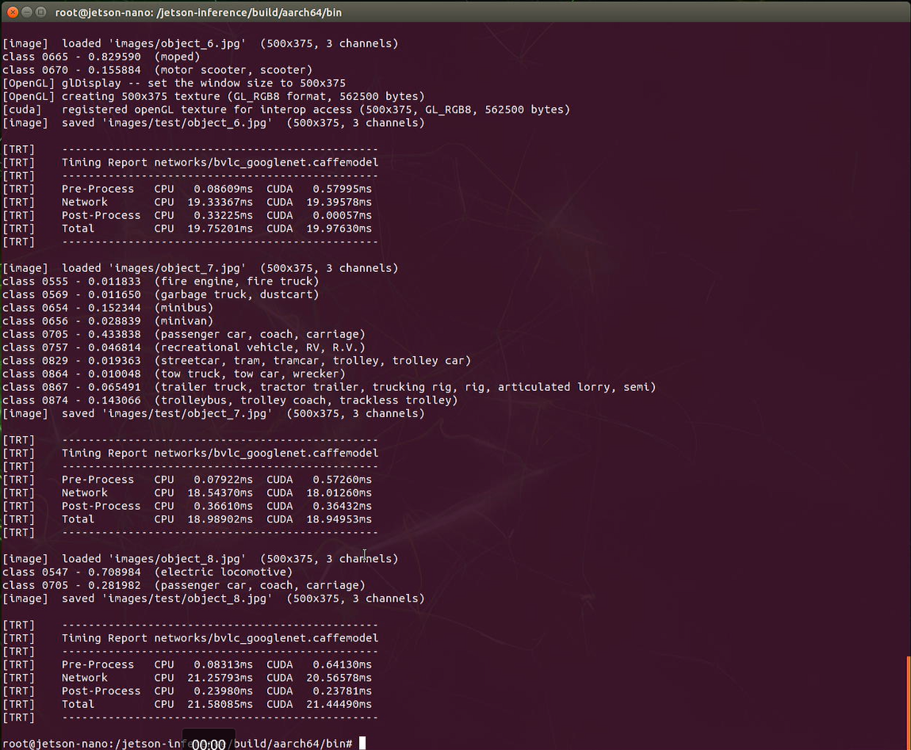
	
# 6. Use ImageNet to classify videos

## 6.1 Download a video from the web.

Download a test video - jelly fish video from below link: 

```
$ wget https://nvidia.box.com/shared/static/tlswont1jnyu3ix2tbf7utaekpzcx4rc.mkv -O jellyfish.mkv
```

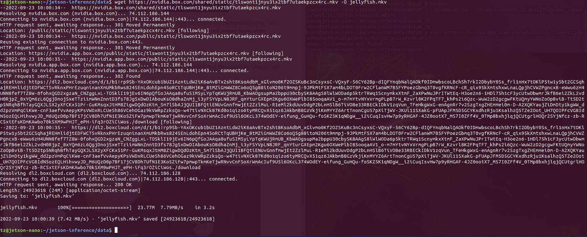


## 6.2 Use ImageNet to classify the video

```
$ imagenet.py data/videos/jellyfish.mkv data/videos/test/jellyfish-googlenet.mkv
```

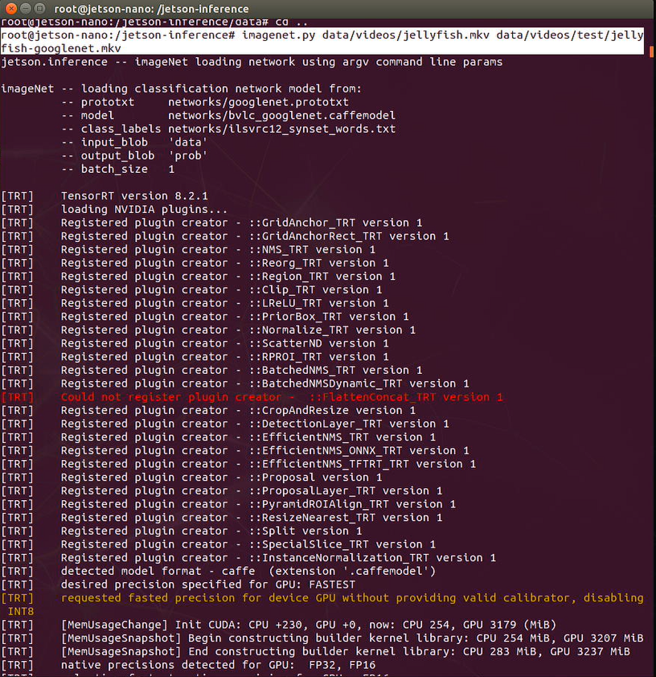


## 6.3 View the classified video

Go to Jetson Nano to view the video classified.

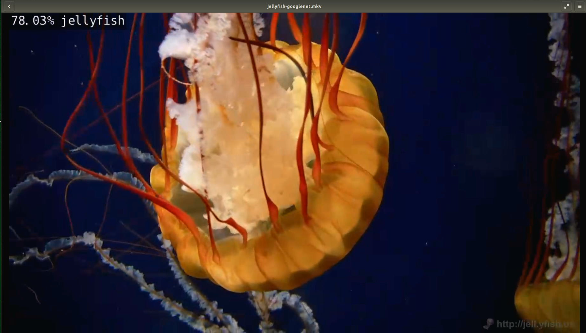

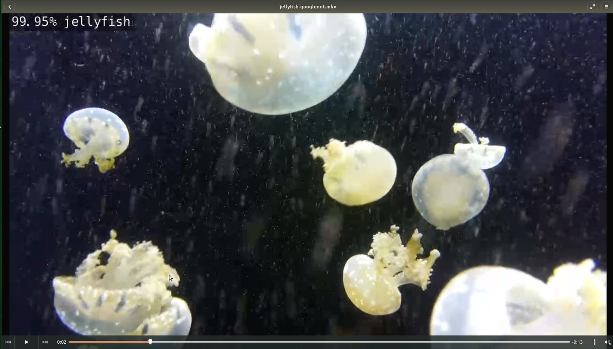

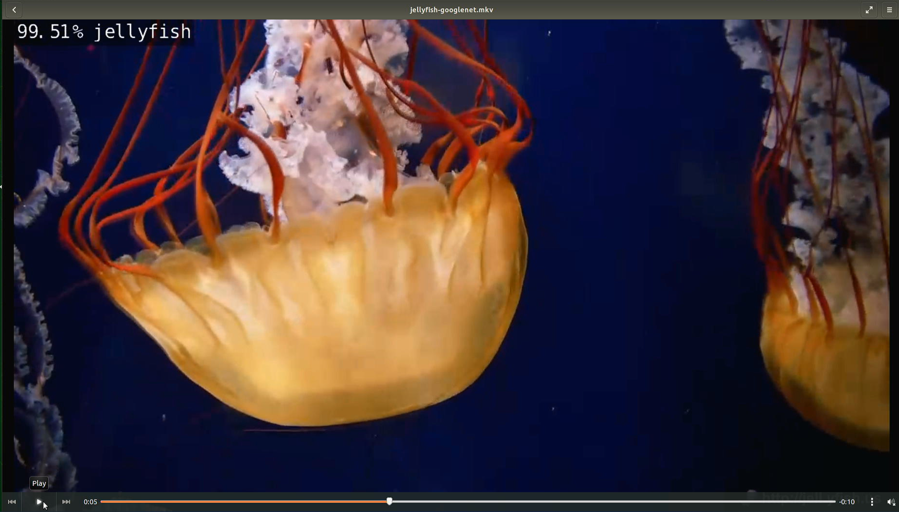


# 7. Use different classification methods to classify images

By default, it uses `GoogleNet` in ImageNet. You can specify which model to load by setting the `--network` flag in the command line.

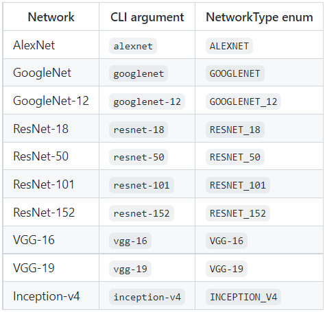


## 7.1 Download other classification models

```
$ cd jetson-inference/tools
$ ./download-model.sh
```

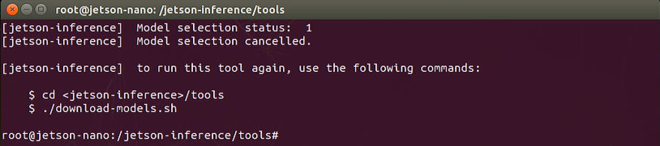

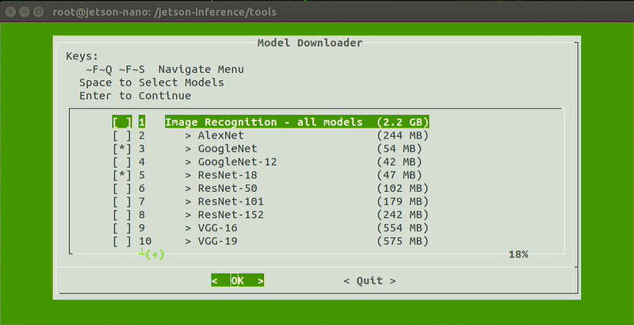


	
## 7.2 Use ResNet-18 to classify images

```
$ imagenet.py --network=resnet-18 data/images/dog_0.jpg data/images/test/dog_0-output.jpg
```
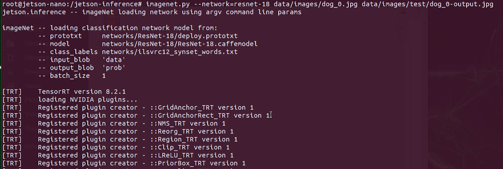


View the classified image using resnet-18.


# 8. Use USB webcam to classify live video streams

```
$ imagenet.py --network=resnet-18 /dev/video0
```
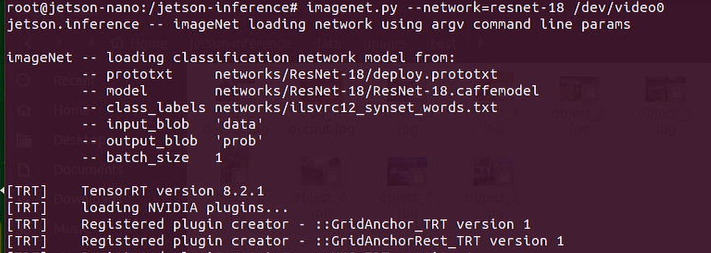

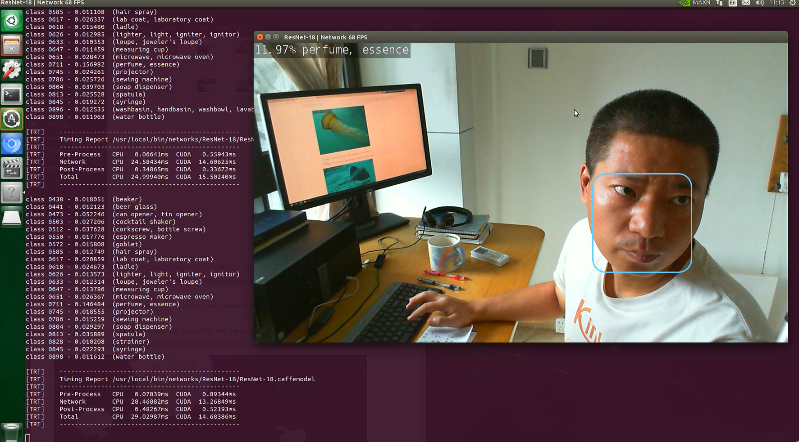

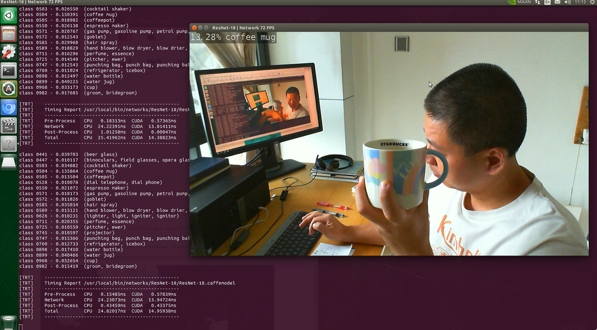

`<END of Lab2>`


