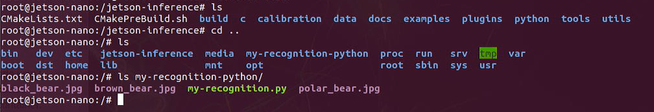

# Lab 3: Develop Your Own Image Recognition Program

# 1. Prerequisties:
- Lab 1, 2 are comopleted.

# 2. Create a project folder 
	
In Jetson-Nano home folder, run below commands.

```	
$ cd ~
$ mkdir my-recognition-python
$ cd my-recognition-python
$ touch my-recognition.py
$ chmod +x my-recognition.py
```


Download some test images from the web.

```
$ wget https://github.com/dusty-nv/jetson-inference/raw/master/data/images/black_bear.jpg 
$ wget https://github.com/dusty-nv/jetson-inference/raw/master/data/images/brown_bear.jpg
$ wget https://github.com/dusty-nv/jetson-inference/raw/master/data/images/polar_bear.jpg 
```	


View the downloaded images from the file explorer.


	
Run the container, mount the project directory created.

```
$ cd ~/jetson-inference
$ docker/run.sh --volume ~/my-recognition-python:/my-recognition-python
```


View the directory mounted to the container.
```
$ cd ..
$ ls my-recognition-python
```	



# 3. Compose the codes

## 3.1 Import modules

Open the source file: my-recognition.py in your editor of choice, like gedit, VS Code, vim, etc. You may edit the codes from outside of the container since they are synchronized automatically.

```
import jetson.inference
import jetson.utils

import argparse
```

## 3.2 Parse the command line

```
# parse the command line
parser = argparse.ArgumentParser()
parser.add_argument("filename", type=str, help="filename of the image to process")
parser.add_argument("--network", type=str, default="googlenet", help="model to use, can be:  googlenet, resnet-18, ect. (see --help for others)")
args = parser.parse_args()
```	

## 3.3 Load the image

```
img =jetson.utils.loadImage(args.filename)
```

## 3.4 Load the image recognition network

```
# load the recognition network
net = jetson.inference.imageNet(args.network)
```

## 3.5 Classify the image

```
    # classify the image
	class_idx, confidence = net.Classify(img)
```

## 3.6 Interpret the results

```
# find the object description
class_desc = net.GetClassDesc(class_idx)

# print out the result
print("image is recognized as '{:s}' (class #{:d}) with {:f}% confidence".format(class_desc, class_idx, confidence * 100))
```


# 4. Run the sample

In the docker, run below commands:

```
$ cd ~/my-recognition-python/
$ my-recognition.py polar_bear.jpg
```


As you may see, the confidence of this recognition is `100%`.
	
Try another one:
```
$ my-recognition.py black_bear.jpg
```


The black_bear recognition confidence is 98%.

Try one more.
```
$ my-recognition.py brown_bear.jpg
```


	
	
The confidence rate of recognizing brown bear is 99%.
	
`<END of Lab3>`