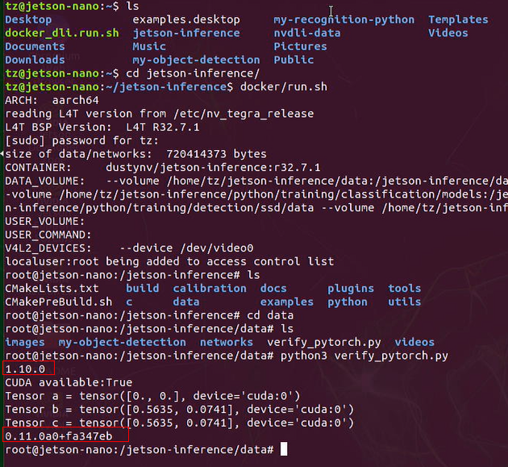

# Lab 4: Re-Train classification / Recognition (ResNet-18)

Transfer learning is a technique for re-training a DNN model on a new dataset, which takes less time than training a network from scratch. 

With transfer learning, the weights of a pre-trained model are fine-tuned to classify a customized dataset.


PyTorch is the machine learning framework that we'll be using in this lab.

We are going to use two datasets to do the re-training.

- Classification / Recognition (ResNet-18)
   - Re-training on the Cat/Dog Dataset

- Object Detection (SSD-Mobilenet)
   - Re-training SSD-Mobilenet

---


# 1. Prerequisites
- Lab 1, is comleted.


# 2. Install PyTorch

This should be automatically installed when you build the repo.

```
$ cd jetson-inference
$ mkdir build
$ cd build
$ cmake ../
$ make -j$(nproc)
$ sudo make install
$ sudo ldconfig
```


If not, you can still install it by running below scripts.

```
$ cd jetson-inference/build
$ ./install-pytorch.sh
```


# 3. Verify PyTorch

Run below codes to verify if PyTorch was installed correctly.

```
>>> import torch
>>> print(torch.__version__)
>>> print('CUDA available: ' + str(torch.cuda.is_available()))
>>> a = torch.cuda.FloatTensor(2).zero_()
>>> print('Tensor a = ' + str(a))
>>> b = torch.randn(2).cuda()
>>> print('Tensor b = ' + str(b))
>>> c = a + b
>>> print('Tensor c = ' + str(c))

>>> import torchvision
>>> print(torchvision.__version__)
```


In the container, run the above script.




# 3. Mounting Swap

For Jetson Nano, you should mount a 4GB of swap space.

```
sudo systemctl disable nvzramconfig
sudo fallocate -l 4G /mnt/4GB.swap
sudo mkswap /mnt/4GB.swap
sudo swapon /mnt/4GB.swap
```

Then add the following line to the end of /etc/fstab to make the change persistent.
`/mnt/4GB.swap none swap sw 0 0`

Run below command to verify.
```
$ free -m
```


# 4. Downloading the Data

Follow below script:

```
$ cd jetson-inference/python/training/classification/data
$ wget https://nvidia.box.com/shared/static/o577zd8yp3lmxf5zhm38svrbrv45am3y.gz -O cat_dog.tar.gz
$ tar xvzf cat_dog.tar.gz
```


View the downloaded images from the file explorer.


# 5. Re-training ResNet-18 Model

```
$ cd jetson-inference/python/training/classification/
$ Python3 train.py --model-dir=models/cat_dog data/cat_dog
```


It will take quite a while to complete the whole re-training process, `4 hours` in my case.

# 6. Training Metrics

The statistics output above during the training process correspond to the following info:

- Epoch: an epoch is one complete training pass over the dataset
	- Epoch: [N] means you are currently on epoch 0, 1, 2, ect.
	- The default is to run for 35 epochs (you can change this with the --epochs=N flag)
- [N/625] is the current image batch from the epoch that you are on
	- Training images are processed in mini-batches to improve performance
	- The default batch size is 8 images, which can be set with the --batch=N flag
	- Multiply the numbers in brackets by the batch size (e.g. batch [100/625] -> image [800/5000])
- Time: processing time of the current image batch (in seconds)
- Data: disk loading time of the current image batch (in seconds)
    - Loss: the accumulated errors that the model made (expected vs. predicted)
	- Acc@1: the Top-1 classification accuracy over the batch
		- Top-1, meaning that the model predicted exactly the correct class
	- Acc@5: the Top-5 classification accuracy over the batch
		- Top-5, meaning that the correct class was one of the Top 5 outputs the model predicted
		- Since this Cat/Dog example only has 2 classes (Cat and Dog), Top-5 is always 100%
		- Other datasets from the tutorial have more than 5 classes, where Top-5 is valid

You can keep an eye on these statistics during training to gauge how well the model is trained, and if you want to keep going or stop and test. As mentioned above, you can restart training again later if you desire.

# 7. Model Accuracy

On this dataset of 5000 images, training ResNet-18 takes approximately ~7-8 minutes per epoch on Jetson Nano, or around 4 hours to train the model to 35 epochs and 80% classification accuracy.


At around epoch 30, the ResNet-18 model reaches 80% accuracy, and at epoch 65 it converges on 82.5% accuracy. With additional training time, you could further improve the accuracy by increasing the size of the dataset (see the Generating More Data section below) or by trying more complex models.

By default the training script is set to run for 35 epochs, but if you don't wish to wait that long to test out your model, you can exit training early and proceed to the next step (optionally re-starting the training again later from where you left off). You can also download this completed model that was trained for a full 100 epochs from here: https://nvidia.box.com/s/zlvb4y43djygotpjn6azjhwu0r3j0yxc

Note that the models are saved under jetson-inference/python/training/classification/models/cat_dog/, including a checkpoint from the latest epoch and the best-performing model that has the highest classification accuracy. This classification/models directory is automatically mounted into the container, so your trained models will persist after the container is shutdown.

# 8. Converting the model to ONNX

To run the re-trained ResNet-18 model with TensorRT for testing and real-time inference, first we need to convert the PyTorch model into ONNX format so that TensorRT can load it.

`ONNX` is an open model format that supports many of the popular ML frameworks, including **PyTorch, TensorFlow, TensorRT**, and others so it simplifies transferring models between tools.

PyTorch comes with `built-in support` for exporting PyTorch models to ONNX, so run below command to convert the Cat/Dog model with the provided onnx_export.py script:

```
$ python3 onnx_export.py --model-dir=models/cat_dog
```


# 9. Processing images with TensorRT

To classify some static test images, use thee extended command-line parameters to imagenet to load the customized ResNet-18 model trained above. 

```
NET=models/cat_dog
DATASET=data/cat_dog

# C++
imagenet --model=$NET/resnet18.onnx --input_blob=input_0 --output_blob=output_0 --labels=$DATASET/labels.txt $DATASET/test/cat/01.jpg cat.jpg

# Python
imagenet.py --model=$NET/resnet18.onnx --input_blob=input_0 --output_blob=output_0 --labels=$DATASET/labels.txt $DATASET/test/cat/01.jpg cat.jpg
```


~[](images/process_image-2.png)

View the cat.jpg.


As you may see, the classification result on a cat is `60.59% dog`, so it's not accurate.

`<END of Lab4>`


