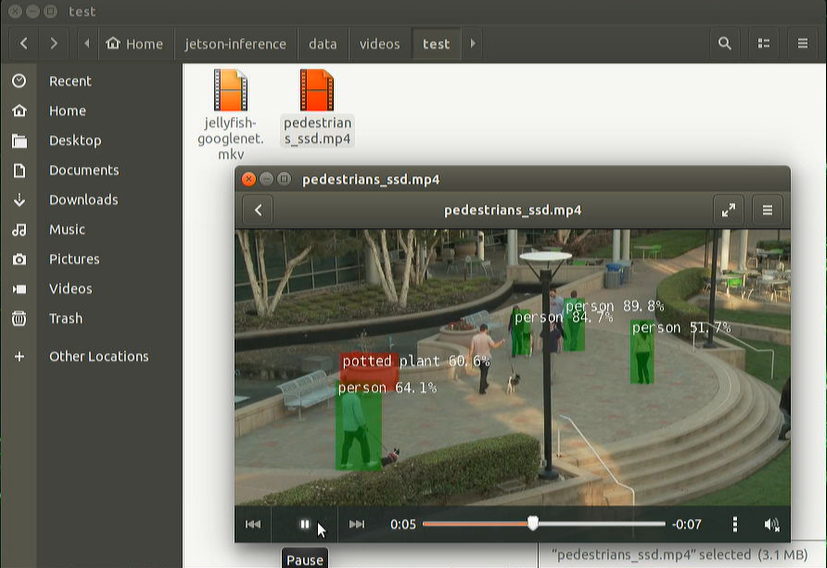

# Lab 5: Locate Objects with DetectNet

The previous recognition examples output `class probabilities` representing the entire input image. Next we're going to focus on `object detection`, and finding `where` in the frame various objects are `located` by extracting their `bounding boxes`. 

Unlike image classification, `object detection networks` are capable of `detecting many different objects` per frame.

The `detectNet` object accepts an image as input, and outputs a `list of coordinates` of the detected bounding boxes along with their classes and confidence values. DetectNet is available to use from Python and C++. See below for various pre-trained detection models available for download. The default model used is a 91-class SSD-Mobilenet-v2 model trained on the MS COCO dataset, which achieves realtime inferencing performance on Jetson with TensorRT.

# 1. Prerequisites
- Lab 1 is completed.
  

# 2. Detecting objects from images

First, let's try using the detectnet program to locates objects in static images. In addition to the input/output paths, there are some additional command-line options:

- optional `--network` flag which changes the detection model being used (the default is SSD-Mobilenet-v2).
- optional `--overlay` flag which can be comma-separated combinations of box, lines, labels, conf, and none
    - The default is --overlay=box,labels,conf which displays boxes, labels, and confidence values
    - The box option draws filled bounding boxes, while lines draws just the unfilled outlines
- optional `--alpha` value which sets the alpha blending value used during overlay (the default is 120).
- optional `--threshold` value which sets the minimum threshold for detection (the default is 0.5).


## 2.1 Run the container
```
$ cd ~/jetson-inference
$ ./docker/run.sh
```


## 2.2 Get a few images with multiple objects inside

Find a few images with multiple people, dogs, and cars, etc., to do the test.


## 2.3 Use DetectNet to detect the objects

```
$ detectnet data/images/4people.jpg data/images/test/4people-output.jpg
$ detectnet data/images/4dogs.jpg data/images/test/4dogs-output.jpg
$ detectnet data/images/3cars.jpg data/images/test/3cars-output.jpg
```

View the results using ImageViewer.


# 3. Processing a directory or sequence of images

Use `wildcards` to do this. Be sure to enclose it in the quotes ("*.jpg").

```
$ detectnet "data/images/fruit_*.jpg" data/images/test/fruit_%i.jpg
```


# 4. Processing video files

## 4.1 Download some test videos

```
$ cd data/videos

$ wget https://nvidia.box.com/shared/static/veuuimq6pwvd62p9fresqhrrmfqz0e2f.mp4 -O pedestrians.mp4

$ wget https://nvidia.box.com/shared/static/i5i81mkd9wdh4j7wx04th961zks0lfh9.avi -O parking.avi
```

## 4.2 Run script to test

```
$ ./detectnet data/videos/pedestrians.mp4 data/videos/test/pedestrians_ssd.mp4
```

The result is as below:




## 4.3  Use other pre-trained detection models

There are some other pre-trained detection models that are can be used.


```
$ cd jetson-inference/tools
$ ./download-models.sh
```


# 5. Run live camera detection

```
$ detectnet /dev/video0
$ detectnet /dev/video0 output.mp4
```


`<END of lab5>`


