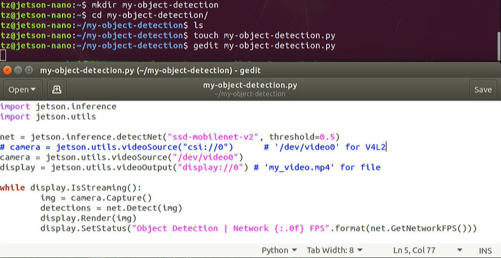
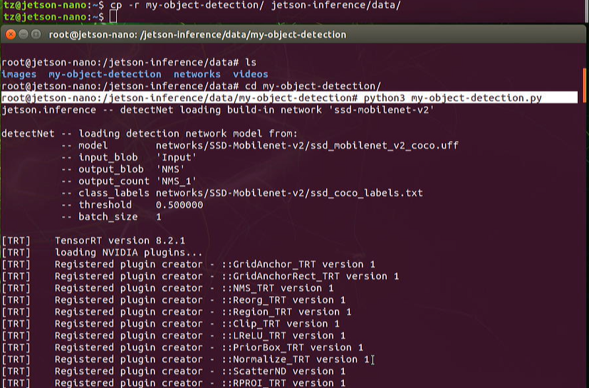
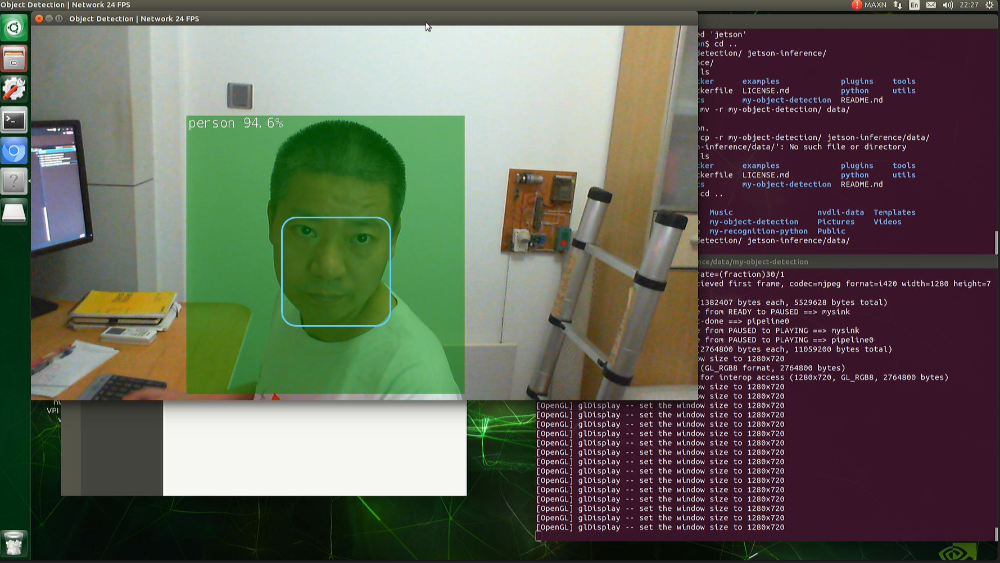
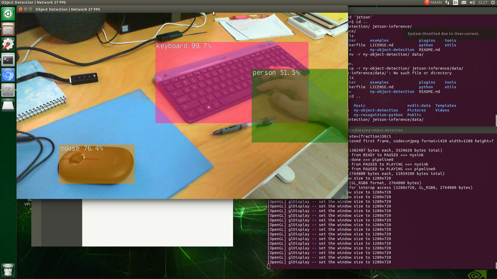

# Develop Your Own Object Detection program


# 1. Source code walk through

## 1.1 Import the modules

```
import jetson.inference
import jetson.utils
```


## 1.2 Load the detection model
```	
# load the object detection model
Net = jetson.inference.detectNet("ssd-mobilenet-v2", threshold=0.5)
```

## 1.3 Open the camera stream

```	
Camera = jetson.utils.videoSource("dev/video0")
```	

## 1.4 Display loop
	
```
display = jetson.utils.videoOutput('display://0")
# display = jetson.utils.videoOutput('display://my-video.mp4")

While display.IsStreaming():
    # main loop will go here
```

## 1.5 Capture camera
	
```
img = cmaera.Capture()
```

## 1.6 Detect objects
```
Detections = net.Detect(img)
```	

## 1.7 Rendering
```
display.Render(img)
display.SetStatus("Object Detection | Network {:.of} FPS".format(net.GetNetworkFPS()))
```


# 2. Create a file and add codes
	
In Jetson Nano folder,

```	
$ mkdir my-object-detection
$ touch my-object-detection.py
$ gedit my-object-detection.py
```




# 3. Run the program

```	
$ cp -r my-object-detection/ jetson-inference/data/
```

In the container, run below:

```	
$ python3 my-object-detection.py
```





	



`<END of Lab6>`

	
	
	
	
	

	
